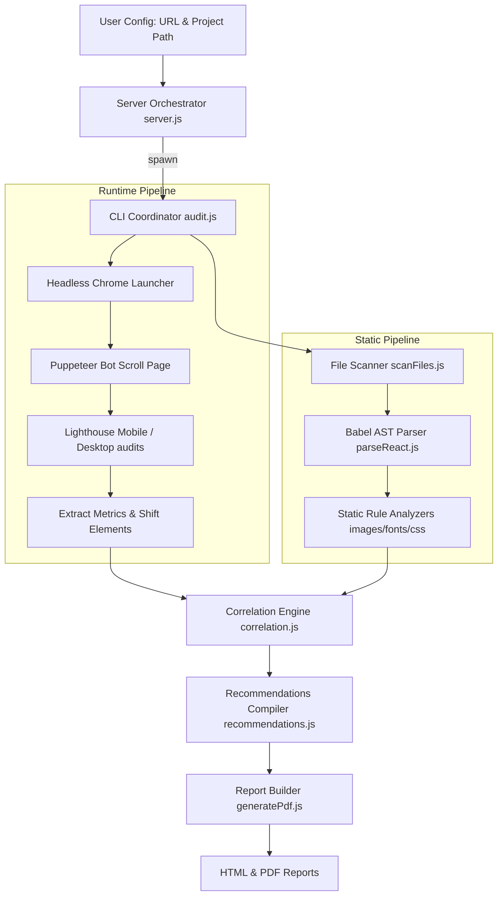

# Core Web Vitals Diagnostic Lab: Engineering Documentation

This repository contains the **Core Web Vitals Diagnostic Lab** (also referred to as `cwv-inspector`), an automated web performance analysis tool. It bridges the gap between **runtime diagnostics** and **local source code configuration**.

Standard Lighthouse reports indicate that a page is slow (e.g. flagging layout shifts on a selector like `div.header > img.logo`), but they cannot tell the developer *where* in their project source files that element is declared.

This tool solves that problem by running a dual-mode scan:
1.  **Synthetic Runtime Scan**: Evaluates page load behavior, metrics, and DOM shifting elements of a live/local URL.
2.  **Static Source Scan**: Recursively processes the project directory, parsing files into Abstract Syntax Trees (ASTs) to locate layout triggers.

By feeding both pipelines into a **Correlation Engine**, the tool maps performance bottlenecks directly to the physical source code files (components, styles) and line numbers.

---

## 1. Overview

This tool combines Lighthouse results from the target URL with a static analysis of the local source-code directory to identify the likely source of performance problems. It helps developers move from *"this page has a poor Core Web Vital"* to *"this specific source file/component is likely contributing to the problem, and here is what can be improved."*

---

## 2. Objective

The primary objectives of the engineering implementation are:
*   To evaluate live URL performance metrics for Core Web Vitals (LCP, CLS, TBT, INP) across Mobile and Desktop viewport contexts.
*   To scan the target project directory to build a code index of layout components, images, CSS font definitions, and dependency structures.
*   To programmatically correlate runtime-shifted selectors with static AST coordinates.
*   To generate structured, grouped recommendations that point to specific lines of code.
*   To compute a unified Health Score and render interactive HTML/PDF diagnostic reports.

---

## 3. Inputs

The tool requires two primary parameters to initiate a performance run:

### A. Project Directory Path
*   **Purpose**: Points the static file scanner to the local codebase.
*   **What is read**: Reads files matching the configured extensions (configured in `config.js` as `.js`, `.jsx`, `.ts`, `.tsx`, `.css`, and `.html`). It skips dependencies and build outputs (`node_modules`, `.git`, `dist`, `build`).
*   **Format**: Absolute local path (e.g., `/Users/sirippireddygiri/Desktop/Quintype/malibu-advanced`).

### B. Target URL
*   **Purpose**: Provides the endpoint that headless Chrome will navigate to during tests.
*   **How it is used**: Passed directly to Puppeteer and Lighthouse to retrieve performance metrics, opportunities, and shift selectors.
*   **Format**: Public or local address (e.g., `http://localhost:3000` or `https://www.google.com`).

---

## 4. High-Level Architecture

The components interact according to the following architecture pipeline:



---

## 5. Complete Execution Flow

When a performance audit is triggered from the Dashboard or CLI:

1.  **Input Verification**: The coordinator resolves and verifies the project path and checks if the URL format is valid.
2.  **File Scan**: `scanFiles.js` gathers workspace files matching extensions and reads their content.
3.  **AST Generation**: `parseReactCode()` in `parseReact.js` parses JS/TS files into AST structures using `@babel/parser`, indexing all JSX elements (``, `<a>`, `<link>`) with line numbers and file names.
4.  **Static Auditing**: Static analyzers (CSS, fonts, JS, images, dependencies) run against the files/ASTs to produce a list of static code issues.
5.  **Browser Boot**: Headless Chrome is launched via `chrome-launcher` on a debugging port.
6.  **Bot Scroll Execution**: Puppeteer connects to the debug port, opens the URL, performs a vertical scroll loop to trigger all lazy-loaded assets, and scrolls back to the top to prime the cache and DOM.
7.  **Lighthouse Run**: Lighthouse runs on the port for both Mobile and Desktop profiles, extracting Core Web Vitals values and the `layout-shift-elements` items.
8.  **Correlation Engine Run**: `correlateCls()` in `correlation.js` matches layout-shifting selectors to static AST element definitions.
9.  **Consolidation**: `compileRecommendations()` deduplicates static issues, merging static image properties (e.g. missing size dimensions) with the matched Lighthouse shift element.
10. **Report Builder**: `generateReport()` replaces placeholders in `template.html` with final scores, metrics, and correlation data, and prints the layout to PDF using Puppeteer.

---

## 6. Lighthouse Integration

### Library & Configurations
*   **Version**: `lighthouse` version `^11.3.0` (programmatic Node.js client).
*   **Invocation**: Evaluated programmatically inside `analyzers/lighthouse.js`.
*   **Categories**: Limits execution strictly to the `performance` category:
    ```javascript
    onlyCategories: ['performance']
    ```
*   **Storage Flag**: Sets `disableStorageReset: true` to prevent Lighthouse from clearing the cache primed by Puppeteer's bot scroll.
*   **Viewport Emulation**:
    *   **Mobile**: Default mobile screen size.
    *   **Desktop**: Explicitly emulates Desktop screens (`width: 1350`, `height: 940`) and turns off mobile emulation.

---

## 7. Puppeteer Integration

Puppeteer (`^22.0.0`) is used for two specific runtime tasks in this project:

### A. Bot Scroll Preloading
To ensure Lighthouse catches LCP images and CLS shifts located below the fold, Puppeteer connects to the Chrome debugging port before Lighthouse starts and navigates to the URL. It executes a scroll-down script in increments of 250px, forcing lazy assets to load and compile in Chrome.

### B. PDF Rendering
After compile recommendations are saved as HTML, Puppeteer launches a separate headless session, loads the HTML string, and generates a print-ready PDF using `page.pdf()`.

---

## 8. Babel & Source Code Parsing

We use `@babel/parser` and `@babel/traverse` inside `scanners/parseReact.js` to inspect JavaScript and TypeScript files statically.

### AST Traversals
*   **`JSXOpeningElement`**: Gathers all tag details. We extract the `tagName`, `id`, `className`, `src`, `href`, and structural line/column locations.
*   **`ImportDeclaration`**: Traces import bindings to check for un-memoized structures or sync script declarations.
*   **`CallExpression`**: Audits React hook declarations (such as `useEffect` dependencies).

This provides a code index that the Correlation Engine queries to map DOM selectors to the correct file path and line number.

---

## 9. Core Web Vitals Metrics

| Metric | What it Measures | Source in Code | Good Threshold |
| :--- | :--- | :--- | :--- |
| **LCP** | Largest Contentful Paint (Load speed) | `audits['largest-contentful-paint']` | &le; 2.5s |
| **CLS** | Cumulative Layout Shift (Visual stability) | `audits['cumulative-layout-shift']` | &le; 0.1 |
| **TBT** | Total Blocking Time (Input delay proxy) | `audits['total-blocking-time']` | &le; 200ms |
| **INP** | Interaction to Next Paint (Responsiveness) | `audits['interaction-to-next-paint']` | &le; 200ms |

---

## 10. Issue Detection

The tool flags performance issues using deterministic rules:
*   **Images**: Legacy image formats (.jpg, .png), missing dimensions (`width`/`height`), or missing lazy-loading below-the-fold.
*   **Fonts**: CSS `@font-face` rules missing `font-display: swap`, or referencing `.woff2` files without preloads.
*   **CSS/JS**: Render-blocking stylesheets or synchronous script tags.
*   **Dependencies**: Bloated npm dependencies (e.g. `lodash` or `moment`) parsed from `package.json`.
*   **React AST**: Missing `React.memo` wrappers or unstable contexts.

---

## 11. Source Code Correlation Engine

The engine in `analyzers/correlation.js` matches layout shifts to source code:

1.  **Extraction**: Extract layout shift targets from Lighthouse (`layout-shift-elements` audit).
2.  **Selector Parsing**: Parses the target CSS selector (e.g. `div.hero > img.banner`) into tag names and classes.
3.  **Candidate Lookup**: Filters AST components to find elements matching the tag name and classes.
4.  **Disambiguation**:
    *   If a unique candidate is found, maps it directly with **High Confidence**.
    *   If multiple elements match, compares the `src` attribute name from the Lighthouse code snippet. If resolved, marks as **High Confidence**.
    *   If still ambiguous, labels the match as **Unresolved** to avoid false mappings.

---

## 12. Recommendations Engine

The consolidator in `analyzers/recommendations.js` processes findings through these steps:

*   **Correlation & Deduplication**: If a layout shift maps to a source element, it checks if `images.js` also flagged that element for missing dimensions. If so, it merges the findings into a single recommendation card, deducting points only once.
*   **Severity Weights**: Score deductions are applied: High severity = **5 points**, Medium = **2 points**, Low = **0.5 points**.
*   **Deduction Formula**:
    $$\text{Health Score} = \max\left(0, \, 100 - (5 \times \text{high} + 2 \times \text{medium} + 0.5 \times \text{low})\right)$$

---

## 13. Report Generation

*   **Format**: Standalone HTML report (`report-<timestamp>.html`) and printed PDF (`report-<timestamp>.pdf`).
*   **Location**: Written to the audited project's `reports/` folder.
*   **Contents**: Performance assessment summary banner, Device tabs (Mobile/Desktop view toggle), Metrics Detail table (including CrUX field data and Lighthouse lab data), and categorized expandable recommendation cards.

---

## 14. Important Files Reference

| File | Responsibility | Key Functions / Exports |
|------|----------------|-------------------------|
| `server.js` | Handles Express web routing, Server-Sent Events (SSE) streaming, and folder dialogs. | `select-folder`, `run-audit` |
| `audit.js` | CLI entry point. Orchestrates the file scan, AST parser, static rules, and report generators. | `main` |
| `analyzers/lighthouse.js` | Launches Chrome, runs the Puppeteer bot scroll, and executes programmatic Lighthouse runs. | `runLighthouseAudit`, `extractScores`, `preScrollPage` |
| `analyzers/correlation.js` | Correlates layout shift selectors with static JSX elements. | `correlateCls`, `parseSelectorComponent` |
| `analyzers/recommendations.js` | Groups findings, deduplicates static/runtime issues, and calculates the health score. | `compileRecommendations` |
| `report/generatePdf.js` | Populates HTML template tags, formats scores, and prints the PDF report using Puppeteer. | `generateReport`, `computeMetricDetails` |

---

## 15. How to Run Locally

### Prerequisites
*   Node.js v18 or newer
*   Google Chrome browser installed

### Installation
Clone the codebase, navigate to `cwv-inspector/`, and install dependencies:
```bash
npm install
```

### Starting the Server
Start the Express server:
```bash
node server.js
```
Open `http://localhost:3000` in your web browser.

### Running an Audit
1.  Click **Select Project Folder** and choose the directory you want to scan.
2.  Enter the URL you want to audit (e.g. `http://localhost:3000`).
3.  Click **Run Audit**. Once complete, the browser will open the generated HTML report.

---

## 16. Execution Example

*   **Target Project Directory**: `/Users/sirippireddygiri/Desktop/Quintype/malibu-advanced`
*   **Target URL**: `https://www.google.com`

### Audit Progress:
1.  Lighthouse runs on the URL and flags a layout shift on the selector: `div.hero > img.banner-img` (CLS shift score: 0.18).
2.  The static scanner traverses the target directory, parses components into AST, and finds a matching JSX node:
    `` inside `src/components/Hero.jsx` on line 14.
3.  Static rule analyzer (`images.js`) flags that `Hero.jsx:14` is missing explicit `width` and `height` attributes.
4.  The Correlation Engine matches the selector to `Hero.jsx:14` with **High Confidence** (evidence: tag matched, classes matched, unique candidate).
5.  `recommendations.js` combines the issues: instead of showing two separate cards, it renders one card under the CLS filter:
    *   **Finding**: *Layout Shift matched to source:  in Hero.jsx*
    *   **Confidence**: *High*
    *   **Lighthouse Selector**: *div.hero > img.banner-img*
    *   **Recommendation**: *Image tag at Hero.jsx:14 is missing explicit width or height attributes. Reserve layout space by providing dimensions.*

---

## 17. Limitations

*   **Authentication & Paywalls**: Headless Chrome starts with a clean profile, so it cannot audit pages behind login walls or paywalls unless session cookies are pre-injected.
*   **Dynamically Injected Sizing**: Static AST analysis cannot evaluate layout dimensions configured at runtime via Javascript calculations or dynamic style bindings.
*   **Lab vs Field Variance**: Synthetic lab tests (Lighthouse) simulate network conditions and do not capture real-user variations like older hardware or network drops.

---

## 18. Troubleshooting Common Failures

*   **Lighthouse execution failed: Chrome not found**: Ensure Google Chrome is installed on the testing machine and available in the default system application path.
*   **Invalid project directory**: Verify the path is correct and has read permissions.
*   **Connection timeout / Unreachable URL**: Verify the site is up and reachable by visiting it in your standard browser.
*   **AST parser errors**: Occur on files with invalid JS/TS syntax. The parser logs these to the console and falls back gracefully to regex scans.

---

## 19. Future Improvements

*   **LCP Correlation**: Apply selector mapping to LCP element diagnostics.
*   **Incremental Scanning**: Cache component AST files and only re-scan files that have changed.
*   **CI/CD Blockers**: Integrate `audit.js` into pre-commit workflows or deploy pipelines to block builds if the Health Score drops below a defined threshold.
*   **Session Importing**: Add cookie import fields to the dashboard configuration panel to audit authenticated routes.

---

## 20. Summary

This Core Web Vitals Diagnostic tool goes beyond standard Lighthouse metrics. By combining **synthetic runtime browser audits** with **static code AST scans**, it maps performance issues directly to the local source files and component lines causing them. This allows developers to quickly locate and fix bottlenecks, keeping performance optimizations aligned with standard development workflows.
