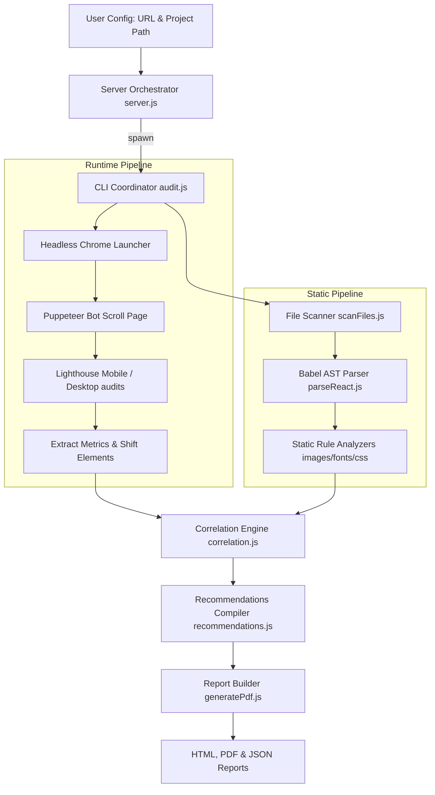

# Core Web Vitals Diagnostic Lab: Engineering Documentation

## Runtime CWV Inspector CLI (`bin/cwv.js`)

This standalone CLI measures a live page in Chrome, correlates measured INP/CLS/LCP evidence with files under `--path`, and emits JSON, console, Markdown, or HTML. It uses 4x CPU throttling and five fresh-page samples per configured interaction; one warm-up sample is discarded. Numbers from this lab run are not field data.

### Setup and usage

Install the repository dependencies with `npm install`, then run:

```bash
node bin/cwv.js analyze fixture --path tests/fixtures/demo-app --format json
node bin/cwv.js analyze https://example.com --path /path/to/source --interactions interactions.json --format md
```

`fixture` serves the directory given by `--path` using the included local fixture server. The page URL may instead be an `http(s)` URL. `--interactions <file.json>` accepts an array of `{ "selector": "...", "type": "click|type", "text": "...", "label": "...", "optional": true }`; `text` is used for `type`. If omitted, the CLI reads `cwv-interactions.json` from the scanned root when present. With neither configuration, it measures page-load metrics but does not probe INP interactions.

### Flags and write behavior

- `--format json|console|md|html` selects the report format (default `json`). JSON goes to stdout and diagnostics go to stderr.
- `--apply` is experimental and writes validated rule-based fixes only. Copilot fixes are never applied by this flag. The default run does not modify the analyzed tree.
- `--verify` applies eligible diffs only to an isolated temporary copy, then performs one discarded warm-up plus five fresh-page measurements. Calibration-suspect runs are excluded; an unavailable measurement is reported as not run.
- `--copilot` permits a real Copilot request for eligible measured findings. A stored response file can be used with `--mock-copilot <file.json>` instead; mock output is always labeled as mock and is never a live call. The flags are mutually exclusive.
- `COPILOT_MODEL` optionally selects the model passed to the Copilot SDK. Authentication and request limits are managed by the installed Copilot CLI/runtime. Without `--copilot` or `--mock-copilot`, fix generation does not call Copilot.
- Copilot INP output is labeled “suggested, unverified.” Failed fixes receive up to two retries, each with the latest validator error. If validation still fails for the demo handler, the report may show a stored chunked fix as an example template; it is not Copilot output and is not eligible for `--apply`.

### Rating and suppression thresholds

Good thresholds used in gain calculations are INP 200 ms, LCP 2.5 s, and CLS 0.1. The reporter suppresses gains below 30 ms for INP, 100 ms for LCP, and 0.02 for CLS; third-party findings are notes, static-only findings cannot exceed LOW, and low-confidence/low-impact findings are hidden. An interaction summary marked `below-threshold-majority` is not emitted as an issue. Estimated gain and measured improvement are shown separately, with the evidence source on each finding.

### Copilot and known limits

Copilot is opt-in. A real request can fail when the Copilot CLI/runtime is unavailable, authentication is missing, or the account quota is exhausted; the report preserves the exact failure and does not replace it with mock data. Lab timings depend on the host and 4x throttling and should not be treated as field performance. LoAF attribution requires Chrome 123 or newer. High-confidence source mapping generally requires source maps; dynamic markup and generated selectors may remain unresolved. CLS cause attribution is based on nearby measured image timings and observed DOM insertions, so unmatched shifts remain lower-confidence.

This repository contains the **Core Web Vitals Diagnostic Lab** (also referred to as `cwv-inspector`), an automated web performance analysis tool. It bridges the gap between **runtime diagnostics** and **local source code configuration**.

Standard Lighthouse reports indicate that a page is slow (e.g. flagging layout shifts on a selector like `div.header > img.logo`), but they cannot tell the developer *where* in their project source files that element is declared.

This tool solves that problem by running a dual-mode scan:
1.  **Synthetic Runtime Scan**: Evaluates page load behavior, metrics, and DOM shifting elements of a live/local URL.
2.  **Static Source Scan**: Recursively processes the project directory, parsing files into Abstract Syntax Trees (ASTs) to locate layout triggers.

By feeding both pipelines into a **Correlation Engine**, the tool maps performance bottlenecks directly to the physical source code files (components, styles) and line numbers.

---

## 1. Overview

When a target URL is provided, Lighthouse findings drive the reported recommendations. Runtime CLS/INP evidence is correlated with the local source index, and static repository findings are included when they support a runtime-correlated issue. If Lighthouse provides no interaction-level INP samples, detected INP code patterns remain visible as low-confidence static-only findings. CrUX or PSI field INP above 200 ms is also reported as a separate field finding with its URL/origin scope; field data cannot identify a local event handler by itself. Without a URL, the tool reports repository-wide static findings.

---

## 2. Objective

The primary objectives of the engineering implementation are:
*   To evaluate live URL performance metrics for Core Web Vitals (LCP, CLS, TBT, INP) across Mobile and Desktop viewport contexts.
*   To scan the target project directory to build a code index of layout components, images, CSS font definitions, and dependency structures.
*   To programmatically correlate runtime-shifted selectors with static AST coordinates.
*   To generate structured, grouped recommendations that point to specific lines of code.
*   To compute a unified Health Score and render interactive HTML/PDF diagnostic reports.
*   To visualize real-world Chrome UX Report (CrUX) field data via histograms.

---

## 3. Inputs

The tool requires two primary parameters to initiate a performance run:

### A. Project Directory Path
*   **Purpose**: Points the static file scanner to the local codebase.
*   **What is read**: Reads files matching the configured extensions in `config.js` (`.js`, `.jsx`, `.ts`, `.tsx`, `.css`, `.html`, `.ejs`, `.vue`, and `.php`). It skips configured dependency, generated, and public asset directories.
*   **Format**: Absolute local path (e.g., `/Users/sirippireddygiri/Desktop/Quintype/malibu-advanced`).

### B. Target URL
*   **Purpose**: Provides the endpoint that headless Chrome will navigate to during tests.
*   **How it is used**: Passed directly to Puppeteer and Lighthouse to retrieve performance metrics, opportunities, and shift selectors.
*   **Format**: Public or local address (e.g., `http://localhost:3000` or `https://www.google.com`).

---

## 4. High-Level Architecture

The components interact according to the following architecture pipeline:


```mermaid
graph TD
    A[User Config: URL & Project Path] --> B[Server Orchestrator server.js]
    B -->|spawn| C[CLI Coordinator audit.js]
    
    subgraph Runtime Pipeline
        C --> D[Headless Chrome Launcher]
        D --> E[Puppeteer Bot Scroll Page]
        E --> F[Lighthouse Mobile / Desktop audits]
        F --> G[Extract Metrics & Shift Elements]
    end
    
    subgraph Static Pipeline
        C --> H[File Scanner scanFiles.js]
        H --> I[Babel AST Parser parseReact.js]
        I --> J[Static Rule Analyzers images/fonts/css]
    end
    
    G --> K[Correlation Engine correlation.js]
    J --> K
    K --> L[Recommendations Compiler recommendations.js]
    L --> M[Report Builder generatePdf.js]
    M --> N[HTML, PDF & JSON Reports]
```

---

## 5. Complete Execution Flow

When a performance audit is triggered from the Dashboard or CLI:

1.  **Input Verification**: The coordinator resolves and verifies the project path and checks if the URL format is valid.
2.  **File Scan**: `scanFiles.js` gathers workspace files matching extensions and reads their content.
3.  **AST Generation**: `parseReactCode()` in `parseReact.js` parses JS/TS files into AST structures using `@babel/parser`, indexing all JSX elements (``, `<a>`, `<link>`) with line numbers and file names.
4.  **Static Auditing**: Static analyzers (CSS, fonts, JS, images, dependencies) inspect files/ASTs. In URL-backed runs, these findings are supporting evidence only and are not reported unless connected to runtime findings.
5.  **Browser Boot**: Headless Chrome is launched via `chrome-launcher` on a debugging port.
6.  **Bot Scroll Execution**: Puppeteer connects to the debug port, opens the original URL, and scrolls to trigger lazy-loaded assets and capture shift attribution. The diagnostic page disables its browser cache; this does not purge CDN or origin caches.
7.  **Lighthouse Run**: Lighthouse runs on the port for both Mobile and Desktop profiles, extracting lab metrics and `layout-shift-elements`. A separate observer captures shift participants during scroll for attribution fallback; its shifts do not replace Lighthouse's CLS metric.
8.  **Correlation Engine Run**: `correlateCls()` in `correlation.js` matches layout-shifting selectors to static AST element definitions.
9.  **Consolidation**: `compileRecommendations()` deduplicates static issues, merging static image properties (e.g. missing size dimensions) with the matched Lighthouse shift element.
10. **Report Builder**: `generateReport()` replaces placeholders in `template.html` with final scores, metrics, and correlation data, and prints the layout to PDF using Puppeteer.

---

## 6. Lighthouse Integration

### Library & Configurations
*   **Version**: `lighthouse` version `^11.3.0` in `package.json`; the lockfile currently resolves `11.7.1`.
*   **Invocation**: Evaluated programmatically inside `analyzers/lighthouse.js`.
*   **Categories**: Limits execution strictly to the `performance` category:
    ```javascript
    onlyCategories: ['performance']
    ```
*   **Storage Flag**: Sets `disableStorageReset: false` to allow consistent clean audits.
*   **Device Emulation & Throttling Specifications**:
    *   **Mobile Audit**:
        *   **Device**: Moto G Power (2022) / `MOTOGPOWER_EMULATION_METRICS`
        *   **Viewport**: `412 × 823` px
        *   **Device Scale Factor (DPR)**: `1.75`
        *   **Mobile Emulation**: `true` (`hasTouch: true`)
        *   **Network Throttling**: Simulated Slow 4G (`150ms` RTT, `1.6 Mbps` throughput)
        *   **CPU Slowdown**: `4x`
    *   **Desktop Audit**:
        *   **Device**: MacOS Desktop / `DESKTOP_EMULATION_METRICS`
        *   **Viewport**: `1350 × 940` px
        *   **Device Scale Factor (DPR)**: `1.0`
        *   **Mobile Emulation**: `false` (`hasTouch: false`)
        *   **Network Throttling**: Simulated Dense 4G (`40ms` RTT, `10 Mbps` throughput)
        *   **CPU Slowdown**: `1x`
*   **Test Configuration Reporting**: Both HTML and PDF reports display a Test Configuration banner in the Executive Summary for Mobile and Desktop audits, detailing the effective viewport, DPR, network throttling, CPU slowdown multiplier, and Lighthouse version.

### Request-level evidence and safe targeting
The HTML findings and companion JSON retain Lighthouse's per-resource evidence for flagged opportunities, capped at 12 rows per audit/device to keep reports bounded. Rows can include the request URL or origin, resource type, transferred/total/unused bytes, estimated time savings, request count, cache lifetime, and node selector/snippet when Lighthouse supplies them. The dedicated `largest-contentful-paint-element` audit is also retained with its LCP candidate DOM node and phase timings (TTFB, load delay, load time, and render delay); Lighthouse may not provide the candidate's network URL in that audit, so use the selector/snippet to find the rendered element and inspect its actual request in DevTools. The report records the total row count and whether rows were truncated.

Use the evidence to target investigation:
1. Open the listed URL and match it to the Network panel request (including the device profile and query string); compare Lighthouse's measured transfer and unused bytes.
2. Map that runtime URL to a local bundle, stylesheet, image, CDN rule, or CMS-managed asset using the application's build output/source maps and asset manifest. The URL alone does **not** prove which repository file produced it.
3. Confirm route usage and runtime behavior before removing or splitting JavaScript/CSS, changing responsive images, or adding preload/preconnect hints. Lighthouse savings are estimates from a synthetic run, not guaranteed field improvements.
4. If a finding has no request rows, treat it as an audit-level signal. Re-run against the exact route with a saved Lighthouse JSON/report and inspect the corresponding audit; do not guess an asset from the title alone.

These rows make lab findings actionable immediately and can be compared across UAT/prod runs without waiting for CrUX aggregation. They do not replace CrUX: field data reflects real users over a rolling 28-day collection window, while Lighthouse is a repeatable lab snapshot under the report's stated throttling/emulation. The detailed HTML report and companion JSON carry the per-request rows; the redesigned executive PDF can summarize findings without listing every request.

---

## 7. Puppeteer Integration

Puppeteer (`^22.0.0`) is used for two specific runtime tasks in this project:

### A. Bot Scroll Preloading and Shift Attribution
Puppeteer connects to the Chrome debugging port before each Lighthouse run and scrolls down the page in increments, prompting lazy assets to load. The observer records unexpected layout-shift entries and candidate DOM sources for correlation. Lighthouse remains authoritative for the reported CLS metric because the observer's full-page event list is not itself the CLS session-window calculation.

### B. PDF Rendering
After compile recommendations are saved as HTML, Puppeteer launches a separate headless session, loads the HTML string, and generates a print-ready PDF using `page.pdf()`.

---

## 8. Babel & Source Code Parsing

We use `@babel/parser` and `@babel/traverse` inside `scanners/parseReact.js` to inspect JavaScript and TypeScript files statically.

### AST Traversals
*   **`JSXOpeningElement`**: Gathers all tag details. We extract the `tagName`, `id`, `className`, `src`, `href`, and structural line/column locations.
*   **`ImportDeclaration`**: Traces import bindings to check for un-memoized structures or sync script declarations.
*   **`CallExpression`**: Detects `memo` / `useMemo` usage for the current React heuristics. It does not inspect hook dependencies or prove that a component is correctly memoized.

This provides a code index that the Correlation Engine queries to map DOM selectors to the correct file path and line number.

---

## 9. Core Web Vitals Metrics

| Metric | What it Measures | Source in Code | Good Threshold |
| :--- | :--- | :--- | :--- |
| **LCP** | Largest Contentful Paint (Load speed) | Lighthouse lab audit; CrUX / optional PSI field data | `config.thresholds.lcp` (2500 ms) |
| **CLS** | Cumulative Layout Shift (Visual stability) | Lighthouse lab audit; CrUX / optional PSI field data | `config.thresholds.cls` (0.1) |
| **TBT** | Total Blocking Time (Input delay proxy) | Lighthouse lab audit | `config.thresholds.tbt` (200 ms) |
| **INP** | Interaction to Next Paint (field responsiveness) | CrUX / optional PSI field data; Lighthouse lab runs do not measure true INP | `config.thresholds.inp` (200 ms) |

### Interpreting lab and field results

Lighthouse lab results are available immediately and are useful for controlled before/after comparisons. CrUX and PSI field data represent a rolling 28-day sample of real Chrome users and update gradually after a deployment; browser cache clearing cannot reset that history. Low-traffic UAT sites may not have enough CrUX samples, so use repeatable Lighthouse runs on UAT for release checks and add your own RUM collection if you need real-user feedback before production CrUX stabilizes. TBT is a lab diagnostic for main-thread blocking, not a substitute measurement for INP; INP requires real interactions.

The audit uses the URL exactly as provided for Lighthouse and PSI. It does not append a random query parameter to attempt to bypass caching, because that can change the tested route or its cache key without purging an edge cache. The custom Puppeteer diagnostic page disables browser caching; this does not change field-data history or CDN behavior.

---

## 10. Issue Detection

The tool flags performance issues using deterministic rules:
*   **Images**: Legacy image formats (.jpg, .png), missing dimensions (`width`/`height`), or missing lazy-loading below-the-fold.
*   **Fonts**: CSS `@font-face` rules missing `font-display: swap`, or referencing `.woff2` files without preloads.
*   **CSS/JS**: Render-blocking stylesheets or synchronous script tags.
*   **Dependencies**: Bloated npm dependencies (e.g. `lodash` or `moment`) parsed from `package.json`.
*   **React AST**: Missing `React.memo` wrappers or unstable contexts.

---

## 11. Source Code Correlation Engine (V5)

The engine in `analyzers/correlation.js` and `analyzers/recommendations.js` matches runtime layout shifts (CLS) and interaction latencies (INP) to source code:

1.  **Extraction**: Gathers shift selectors and interaction timings (input delay, processing duration, presentation delay) from mobile and desktop Lighthouse profiles.
2.  **Selector Parsing**: Parses the target CSS selector into tag names and classes.
3.  **AST Code Mappings**: Filters the static codebase JSX components matching the tags/classes.
4.  **Event Handler Tracing**: Inspects Babel AST nodes to map handlers (e.g. `onClick={handleSave}`) to functions (arrow functions, variable declarators, method declarations) and trace nested calls up to 2 frames deep. Prevents recursive cycle loops.
5.  **Phase Validation & Negative Correlation**:
    *   **Input Delay dominant**: Aligns with third-party or blocking initialization script operations.
    *   **Processing Duration dominant**: Aligns with fetch, computation, or async task operations.
    *   **Presentation Delay dominant**: Aligns with reflow, rendering, or memo list updates.
    *   *Mismatched operations trigger a negative correlation penalty, reducing the match score.*

---

## 12. Recommendations Engine & Quality States (V5)

The consolidator in `analyzers/recommendations.js` aggregates findings and determines the alignment quality:

*   **Five Correlation States**:
    *   `EXACT`: Exact selector and event matches with successfully resolved local function definitions matching the dominant latency phase.
    *   `STRONG`: High confidence signal alignment but missing one minor trace (e.g., phase alignment mismatch or unresolved inner calls), or field INP strongly correlated with an identified interactive handler.
    *   `PARTIAL`: Weak selector match or local interaction triggering third-party script loops.
    *   `UNRESOLVED`: Lighthouse interaction occurred, but no source components match.
    *   `STATIC_ONLY`: Static rules triggered, but page runtime was within Good limits (&le; 200ms).
*   **Worst-Interaction Outlier Aggregation**: Deduplicates multiple sample events on the same selector, retaining only the worst (highest latency) observation.
*   **Ranking & Score Deductions**: Grouped recommendations are sorted by metrics latency score first, correlation state weight second, and severity third. Deductions are calculated as: High = **5 points**, Medium = **2 points**, Low = **0.5 points**.
*   **Deduction Formula**:
    $$\text{Health Score} = \max\left(0, \, 100 - (5 \times \text{high} + 2 \times \text{medium} + 0.5 \times \text{low})\right)$$

---

## 13. Enhanced INP Recommendations: Actionable Developer-Centric Root Causes

When real-user CrUX field data reports elevated Interaction to Next Paint (e.g. 228ms p75), developers need immediately actionable guidance inside their codebase rather than a detached summary card. CWV Inspector correlates real-user field latency directly with the codebase's interactive components.

### 1. Direct Code Correlation over Generic CrUX Placeholders
*   **Previous Limitation**: In previous versions, elevated field INP emitted an orphaned issue (`Runtime Audit (CrUX Field Data)`, line `-`) which sorted to `#01` because of its latency score, providing no file location, no root-cause explanation, and no code fix.
*   **Current Engine**: Elevated field INP is correlated directly with scanned interaction handlers (`onClick`, `onChange`, `onSubmit`, `onKeyDown`), forced layout reflows (Layout Thrashing), and heavy render loops. The primary interactive code finding is elevated to `#01` with field evidence attached, while general field observations are demoted below actionable code fixes.

### 2. The Four Pillars of Every INP Suggestion
Every INP recommendation is built to answer four fundamental questions for the developer:

1.  **WHERE it is**: Pinpoints the exact relative file path and 1-based source code line number (e.g. `src/components/Navigation.jsx:42`).
2.  **WHY it causes the problem (`whyExplanation`)**: Details the exact technical mechanism causing main-thread blocking (e.g. synchronous React state setters causing unmemoized subtree re-renders, alternating DOM style writes and layout reads causing synchronous reflow, or un-deferred network calls inside event loops).
3.  **WHAT to fix (`suggestion`)**: Clear, actionable remediation guidance (e.g. wrapping state updates in React's `startTransition()`, scheduling DOM writes with `requestAnimationFrame()`, or yielding with `requestIdleCallback()`).
4.  **CODE (`codeContext` & `fixCode`)**:
    *   **Source Code Preview (`codeContext`)**: Renders surrounding lines of code directly from the repository with the flagged target line highlighted.
    *   **Suggested Code Fix (`fixCode`)**: Provides a side-by-side Before / After code diff showing the problematic code pattern alongside the optimized implementation.

### 3. Data Integrity & Multi-File Aggregation
*   **Preserved Code Context**: Recommendation grouping in `analyzers/recommendations.js` preserves `whyExplanation`, `codeContext`, `fixCode`, `handler`, `operation`, and `source` across all aggregation passes.
*   **Multi-File Clarity**: When a code pattern affects multiple files (e.g. `React state update in onClick across 11 files`), the accordion displays the full list of affected files and line numbers while rendering the primary occurrence's highlighted source code preview and recommended Before/After code fix.
*   **Dedicated Correlated Cards**: Correlated interactive bottlenecks are indexed with unique file-and-line keys, ensuring top priority offenders appear as dedicated high-visibility cards.

---

## 14. Report Generation

*   **Format**: Standalone HTML report (`report-<timestamp>.html`), printed PDF (`report-<timestamp>.pdf`), and companion JSON (`report-<timestamp>.json`).
*   **Location**: Written to the audited project's `reports/` folder.
*   **Contents**: Performance assessment summary banner, Device tabs (Mobile/Desktop view toggle), Metrics Detail table (including CrUX field data and Lighthouse lab data), and categorized expandable recommendation cards. Lighthouse cards show request evidence when the audit supplies it; the companion JSON preserves the structured rows, audit ID, device, potential savings, and truncation status.

---

## 15. Important Files Reference

| File | Responsibility | Key Functions / Exports |
|------|----------------|-------------------------|
| `server.js` | Native HTTP routes, Server-Sent Events (SSE) streaming, report access, and folder dialogs. | `select-folder`, `run-audit` |
| `audit.js` | CLI entry point. Orchestrates the file scan, AST parser, static rules, and report generators. | `main` |
| `analyzers/lighthouse.js` | Launches Chrome, runs the Puppeteer bot scroll, and executes programmatic Lighthouse runs. | `runLighthouseAudit`, `extractScores`, `preScrollPage` |
| `analyzers/correlation.js` | Correlates layout shift selectors with static JSX elements. | `correlateCls`, `parseSelectorComponent` |
| `analyzers/recommendations.js` | Groups findings, deduplicates static/runtime issues, and calculates the health score. | `compileRecommendations` |
| `analyzers/aiAdvisor.js` | Automatically enriches prioritized findings with GitHub Copilot AI recommendations. | `enrichAuditWithCopilot` |
| `report/generatePdf.js` | Populates HTML template tags, formats scores, and orchestrates PDF generation. | `generateReport`, `computeMetricDetails` |
| `report/redesignedPdfTemplate.js` | Builds the redesigned 3-page executive PDF report (hero executive summary, CrUX field trends, and metrics detail with findings). | `buildRedesignedPdfHtml`, `extractCruxHistoryPoints` |

---

## 16. How to Run Locally

### Prerequisites
*   Node.js v18 or newer
*   Google Chrome browser installed

### Installation
Clone the codebase, navigate to `cwv-inspector/`, and install dependencies:
```bash
npm install
```

### Environment Variables (.env)
Place a `.env` file in `cwv-inspector/` or export environment variables before starting the audit. Google API keys are not bundled; each data source is skipped when its key is unset.
```env
# Optional: enables CrUX field data and historical trends
CRUX_API_KEY=your_chrome_ux_report_api_key

# Optional: enables PageSpeed Insights lab and field data
PSI_API_KEY=your_pagespeed_insights_api_key

# Optional: limits automatic Copilot advice (default: 5 findings)
COPILOT_MAX_ISSUES=5

# Optional: explicit GitHub token instead of the Copilot CLI's signed-in user
COPILOT_GITHUB_TOKEN=your_github_token
```

Copilot authentication defaults to the user signed in to the Copilot CLI. Do not commit `.env` or put tokens in source control. The previous code contained Google API key literals; if those keys were active, rotate them in Google Cloud and configure replacements only through the environment.

### Starting the Server & Web Dashboard
Start the native HTTP dashboard server:
```bash
node server.js
```
Open `http://localhost:3000` in your web browser.

**Running an Audit from the Dashboard**:
1.  Click **Select Project Folder** and choose the directory you want to scan.
2.  Enter the URL you want to audit (e.g. `http://localhost:3000`).
3.  Click **Run Audit**. Once complete, the browser will open the generated HTML report.

### Running Audits via CLI
Run the command-line audit directly:
```bash
node audit.js <project-path> [options]
```

**CLI Options**:
*   `--url <url>`: Target live/local URL for Lighthouse performance and Core Web Vitals audit.
*   `--branch <branch>`: Override or specify Git branch name (default: auto-detected).
*   `--engineer <name>`: Set author/engineer name for reports (default: `Siripireddy Giri`).
*   `--all-ai`: Opt in to Copilot advice for up to 999 eligible findings; this can make many model calls.
*   `--max-ai <count>`: Set maximum number of issues to enrich with Copilot (default: `5`).
*   `--no-ai`: Disable Copilot AI enrichment entirely.
*   `--help, -h`: Show usage guide.

Copilot enrichment sends one concise prompt per selected finding and defaults to high and medium severity issues. When a verified file and line are available, the prompt includes at most 17 nearby source lines (capped at 2,400 characters), plus the runtime evidence already attached to the finding. It does not send the whole repository. The companion JSON report records observed input/output token totals and request multipliers; these are usage metrics, not a currency estimate. Transient retries are disabled by default because a timed-out request may already have been processed. The advice cache is in-memory and does not carry across separate dashboard audit processes.

---

## 17. Execution Example

*   **Target Project Directory**: `/Users/sirippireddygiri/Desktop/Quintype/malibu-advanced`
*   **Target URL**: `https://www.google.com`

### Audit Progress:
1.  Lighthouse runs on the URL and flags a layout shift on the selector: `div.hero > img.banner-img` (CLS shift score: 0.18).
2.  The static scanner traverses the target directory, parses components into AST, and finds a matching JSX node:
    `` inside `src/components/Hero.jsx` on line 14.
3.  Static rule analyzer (`images.js`) flags that `Hero.jsx:14` is missing explicit `width` and `height` attributes.
4.  The Correlation Engine matches the selector to `Hero.jsx:14` with **High Confidence** (evidence: tag matched, classes matched, unique candidate).
5.  `recommendations.js` combines the issues: instead of showing two separate cards, it renders one card under the CLS filter:
    *   **Finding**: *Layout Shift matched to source:  in Hero.jsx*
    *   **Confidence**: *High*
    *   **Lighthouse Selector**: *div.hero > img.banner-img*
    *   **Recommendation**: *Image tag at Hero.jsx:14 is missing explicit width or height attributes. Reserve layout space by providing dimensions.*

---

## 18. Limitations

*   **Authentication & Paywalls**: Headless Chrome starts with a clean profile, so it cannot audit pages behind login walls or paywalls unless session cookies are pre-injected.
*   **Heuristic Source Analysis**: Most static rules use AST indexing plus simple text/regex heuristics. A finding is a lead to inspect, not proof of a measured cause. Dynamic values, generated classes, build output, source maps, and runtime-only markup can prevent an exact source match.
*   **Dynamically Injected Sizing**: Static AST analysis cannot evaluate layout dimensions configured at runtime via Javascript calculations or dynamic style bindings.
*   **Lab vs Field Variance**: Synthetic lab tests (Lighthouse) simulate network conditions and do not capture real-user variations like older hardware or network drops.

---

## 19. Troubleshooting Common Failures

*   **Lighthouse execution failed: Chrome not found**: Ensure Google Chrome is installed on the testing machine and available in the default system application path.
*   **Invalid project directory**: Verify the path is correct and has read permissions.
*   **Connection timeout / Unreachable URL**: Verify the site is up and reachable by visiting it in your standard browser.
*   **AST parser errors**: Occur on files with invalid JS/TS syntax. The parser logs these to the console and falls back gracefully to regex scans.

---

## 20. Future Improvements

*   **LCP Correlation**: Apply selector mapping to LCP element diagnostics.
*   **Incremental Scanning**: Cache component AST files and only re-scan files that have changed.
*   **CI/CD Blockers**: Integrate `audit.js` into pre-commit workflows or deploy pipelines to block builds if the Health Score drops below a defined threshold.
*   **Session Importing**: Add cookie import fields to the dashboard configuration panel to audit authenticated routes.

---

## 21. Summary

This Core Web Vitals Diagnostic tool combines **synthetic runtime browser audits** with **static source lookup**. For URL-backed runs, Lighthouse findings are the starting point; local source details are attached where selectors and available runtime evidence support a match. A source match is heuristic and may remain unresolved when markup is dynamic, selectors are generated, or several components match. Without a URL, the tool can still perform a repository-wide static audit.

---

## 22. Enhanced 95% Metric Coverage Implementation

To close the metric coverage gap across INP, CLS, and LCP as specified in `CWV_95_PERCENT_PLAN.md` and `CWV_IMPLEMENTATION_PLAN.md`, the following core modules and analyzers are active:

### 1. AST Traversal & Call Graph Tracing (`utils/astTraversal.js`)
*   **`followFunctionCalls(rootFunc, fileFunctions, fileCalls, maxDepth)`**: Recursively traces function invocation chains from event handlers to nested helper functions with cycle protection.
*   **`getFullFunctionScope(functionName, content, fileFunctions, maxLines)`**: Extracts the complete function implementation without arbitrary line truncation.
*   **`extractFunctionCalls(scopeText)`**: Extracts called function identifiers from code blocks while filtering reserved language keywords.
*   **`findAllEventHandlers(files)`**: Scans workspace files for vanilla JavaScript (`addEventListener`), direct property listeners (`element.onclick`), and jQuery (`.on()`).
*   **`detectLayoutThrashingInScope(lines, startLineIndex, windowSize)`**: Detects forced synchronous layouts where DOM writes (`style.*`, `classList.*`) are immediately followed by geometry reads (`offsetHeight`, `clientWidth`, `getBoundingClientRect`).

### 2. Validation & Verification Framework (`utils/validationHelpers.js`)
*   **`validateImageSizing(tag, cssRules)`**: Comprehensive dimension validation checking for missing dimensions, relative percentage widths (`width="100%"`) lacking height or CSS `aspect-ratio`, and matching stylesheet rules.
*   **`validateHandlerDeferral(handlerCode)`**: Evaluates whether interaction handlers properly yield or defer state updates via `startTransition`, `requestIdleCallback`, `requestAnimationFrame`, or `setTimeout`.
*   **`generateVerificationGuidance(cwv, issue)`**: Attaches concrete `howToVerify` instructions containing verification methods, terminal commands (`npm run audit -- --url <url> --verify`), and quantified expected metrics improvements to every recommendation.

### 3. High-Coverage INP Analysis (`analyzers/inp.js`)
*   **Vanilla JS & jQuery Event Handlers**: Detects un-deferred network calls and heavy sync loops across non-React and vanilla scripts.
*   **Heavy Operations Categorization**: Pinpoints cryptographic operations (`sha256`, `encryptData`), JSON parsing inside loops, DOM queries (`querySelector`, `getElementById`) in loops, and intensive regex executions.
*   **Render-Blocking Scripts in `<head>`**: Identifies synchronous `<script>` tags in document `<head>` that delay DOM parsing and postpone event listener attachment.
*   **Smart React State Update Analysis**: Skips re-render warnings when components are already protected by `React.memo` or list virtualization (`react-window`, `react-virtualized`).

### 4. High-Coverage CLS Analysis (`analyzers/cls.js`)
*   **Image Sizing & Ratio Validation**: Catches images missing width/height attributes, relative `%` widths without ratio, and responsive `srcSet` elements lacking consistent aspect-ratio constraints.
*   **Dynamic Asynchronous State Renders**: Flags unreserved async conditional renders, including boolean ternary operators (`{isLoading ? null : <Story />}`), negations (`{!hasData && <Story />}`), and `useEffect` fetch setters lacking skeleton placeholders.
*   **Font Loading Shift Detection (FOIT / FOUT)**: Scans CSS files for `@font-face` declarations lacking `font-display: swap` or `font-display: optional`.
*   **Intersection Observer Content Insertion**: Detects dynamic DOM injection (`innerHTML`, `appendChild`) upon viewport intersection where container `min-height` or `aspect-ratio` is not pre-reserved.

### 5. High-Coverage LCP Analysis (`analyzers/lcp.js`)
*   **Runtime LCP Correlation**: Matches Lighthouse runtime LCP candidate elements (`lcpElement`) against source code AST and templates.
*   **Network Request Priority Analysis**: Flags when primary LCP hero images are preceded by >2 render-blocking stylesheets or synchronous scripts in `<head>`.
*   **Image Format Optimization**: Recommends modern AVIF and WebP formats with `<picture>` fallbacks for legacy `.jpg`/`.png` hero assets.
*   **Responsive Sizing Delivery**: Recommends `srcSet` and `sizes` attributes for hero images to prevent mobile viewports from downloading desktop-resolution assets.
*   **Preconnect Limits**: Enforces a strict limit of 2–4 critical origins for `<link rel="preconnect">` to avoid browser socket contention.

### 6. Executive Report & PDF Verification Guidance (`report/generatePdf.js`)
*   Every issue rendered in the report and generated PDF displays an integrated **"How to Verify Fix"** card, showing developers the exact test command and expected performance outcome.
